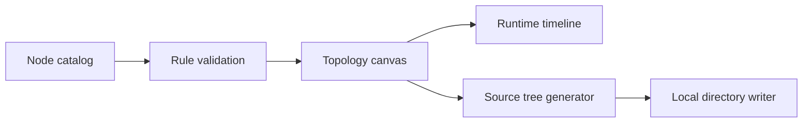

<div align="center">
  
</div>

<p align="center">
  <strong>Design, simulate, learn, and generate backend systems from a visual topology.</strong>
</p>

<p align="center">
  <a href="./README.md">English</a> · <a href="./README.zh-CN.md">简体中文</a>
</p>

ServiceSmith is an open-source visual backend architecture lab. Drag service nodes onto a canvas, connect them into a topology, watch requests move through the system, learn how every component works, and generate runnable Spring Boot or Go Iris source code directly from the design.

The project is currently at **0.1 Alpha**. It is ready for local exploration, teaching, and collaborative development, but is not yet intended for production orchestration.

## Features

- Node library grouped by traffic entry, application services, data stores, messaging, service governance, and observability
- Add nodes by click or drag-and-drop, with prerequisite and instance-limit validation before insertion
- Move topology nodes and create HTTP, SQL, CACHE, EVENT, and other connection types
- Select, configure, or remove an individual connection without affecting either node or its other relationships
- Inspect configuration, recommended usage, implementation concepts, and common pitfalls in the detail panel
- Run the workflow and follow a dynamic timeline that explains what each node is doing
- Generate Controller → Service → DAO projects from backend service nodes
- Support Java Spring Boot, Maven, Gradle, Golang Iris, and Go Workspace
- Map MySQL, Redis, Kafka, Envoy, Prometheus, and other topology nodes into project configuration
- Write generated source directly to a directory selected by the user—no uploads and no ZIP archive
- English interface by default, with a persistent English/简体中文 switch

## Quick start

Requires Node.js 20.19 or later.

```bash
git clone <repository-url>
cd ServiceSmith
npm install
npm run dev
```

Open the local address printed by Vite, usually `http://localhost:5173`.

Run all build checks with:

```bash
npm run check
```

## How to use

### Design a topology

1. Search or browse the node library on the left.
2. Click the plus button or drag a node onto the canvas.
3. If a prerequisite is missing, add the dependency shown in the locked-node message.
4. Click the output port of a source node, then the input port of a target node to create a connection.
5. Select a node or connection to edit its independent settings in the right panel.

### Observe the runtime

Select **Run Workflow**. ServiceSmith starts from a client or the first node, traverses the topology, and explains the current operation and its technical principles in the runtime timeline.

### Generate project source

1. Select **Create Project** in the top bar.
2. Choose Spring Boot or Go Iris.
3. Configure the project prefix, namespace, versions, ports, and project capabilities.
4. Confirm the service and infrastructure nodes to map.
5. Select **Choose Directory & Create**.

ServiceSmith creates a new project folder in the selected location. If a folder with the same name already exists, it stops before writing to protect existing source code.

Directory output uses the File System Access API. Use a current Chromium browser such as Chrome or Edge, and access ServiceSmith through `localhost` or HTTPS.

## Architecture



See [docs/ARCHITECTURE.md](docs/ARCHITECTURE.md) for the detailed design.

## Code map

- `src/catalog.ts` — node definitions, configuration fields, dependency rules, and learning content
- `src/catalogLocale.ts` — localized node and category content
- `src/i18n.tsx` — global language state and persistence
- `src/validation.ts` — node insertion rule engine
- `src/App.tsx` — node library, topology canvas, inspectors, and runtime timeline
- `src/ProjectWizard.tsx` — visual project creation wizard
- `src/projectGenerator.ts` — Spring Boot and Go Iris source-tree generator
- `src/directoryWriter.ts` — directory picker, recursive writes, and conflict protection

## Project status

Implemented:

- Node catalog and dependency validation
- Topology canvas and independent connection management
- Node knowledge panel and dynamic runtime timeline
- Spring Boot and Go Iris base-template generation
- Direct local-directory source output
- English and Simplified Chinese interface

Planned:

- Undo and redo
- Port types and connection compatibility rules
- Workflow JSON import and export
- Richer execution simulation and fault injection
- OpenTelemetry trace integration
- Additional language and framework templates

See [ROADMAP.md](ROADMAP.md) for the complete plan.

## Contributing

Contributions to node types, teaching scenarios, project templates, tests, and documentation are welcome. Please read:

- [Contributing Guide](CONTRIBUTING.md)
- [Code of Conduct](CODE_OF_CONDUCT.md)
- [Security Policy](SECURITY.md)

## Security and privacy

ServiceSmith is currently a client-side application. Topologies and settings remain in the browser, and generated source is written only to a directory explicitly authorized by the user. Never reuse example passwords from generated templates in production.

Report security issues privately according to [SECURITY.md](SECURITY.md); do not open a public issue.

## License

ServiceSmith is released under the [MIT License](LICENSE).
