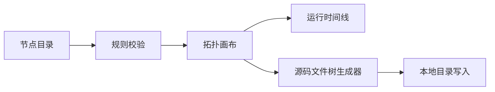

# ServiceSmith

> Design, simulate, and generate backend systems from a visual topology.

ServiceSmith（服务锻造台）是一个开源的可视化后端架构实验室。你可以拖拽服务节点搭建拓扑、观察请求运行过程、学习节点背后的技术原理，并根据当前拓扑直接生成 Spring Boot 或 Go Iris 项目源码。

当前版本处于 **0.1 Alpha** 阶段，适合本地体验、教学演示和共同开发，暂不建议直接用于生产系统编排。

## 核心能力

- 按流量入口、应用服务、数据存储、消息系统、服务治理和可观测性分组的节点库
- 点击或拖拽添加节点，添加前校验依赖、最少数量和实例上限
- 可移动拓扑节点并创建 HTTP、SQL、CACHE、EVENT 等连接
- 单独选择、配置或删除连接，不影响两端节点和其他调用关系
- 右侧查看节点配置、推荐用法、实现原理和常见问题
- 运行工作流并查看请求经过节点时的动态时间线
- 根据后端服务节点生成 Controller → Service → DAO 分层项目
- 支持 Java Spring Boot、Maven、Gradle、Golang Iris 和 Go Workspace
- 将 MySQL、Redis、Kafka、Envoy、Prometheus 等拓扑节点映射为工程配置
- 通过系统目录选择器直接写入项目源码，不上传配置、不生成压缩包

## 快速开始

要求 Node.js 20.19 或更高版本。

```bash
git clone <repository-url>
cd servicesmith
npm install
npm run dev
```

打开终端输出的本地地址，通常为 `http://localhost:5173`。

生产构建检查：

```bash
npm run check
```

## 基本使用

### 设计拓扑

1. 从左侧节点库搜索或选择节点。
2. 点击加号，或把节点拖入画布。
3. 节点不满足前置条件时，根据锁定提示先添加依赖。
4. 点击源节点右侧端口，再点击目标节点左侧端口创建连接。
5. 点击节点或连接，在右侧修改其独立配置。

### 观察运行

点击“运行工作流”，ServiceSmith 会从客户端或第一个节点开始遍历拓扑，并在运行时间线中展示当前节点和对应技术原理。

### 生成项目源码

1. 点击顶部“创建项目”。
2. 选择 Spring Boot 或 Go Iris。
3. 配置项目前缀、命名空间、版本、端口和基础能力。
4. 确认需要映射的服务与基础设施节点。
5. 点击“选择目录并创建项目”。

ServiceSmith 会在所选位置创建一个新的项目目录。同名目录存在时会停止写入，避免覆盖已有源码。

目录写入依赖 File System Access API，建议使用最新版 Chrome、Edge 等 Chromium 浏览器，并通过 `localhost` 或 HTTPS 访问。

## 架构概览



详细设计见 [docs/ARCHITECTURE.md](docs/ARCHITECTURE.md)。

## 主要代码

- `src/catalog.ts`：节点目录、配置字段、依赖规则和知识内容
- `src/validation.ts`：节点添加规则引擎
- `src/App.tsx`：节点库、拓扑画布、连接检查器和运行时间线
- `src/ProjectWizard.tsx`：可视化项目创建向导
- `src/projectGenerator.ts`：Spring Boot 与 Go Iris 源码文件树生成器
- `src/directoryWriter.ts`：系统目录选择、递归写入与冲突保护

## 项目状态

已完成：

- 节点目录与依赖校验
- 拓扑画布和连接管理
- 节点知识与动态运行时间线
- Spring Boot、Go Iris 基础模板生成
- 本地目录源码输出

规划中：

- 撤销与重做
- 端口类型及连接兼容性校验
- 工作流 JSON 导入导出
- 更完整的模拟执行和故障注入
- OpenTelemetry 真实链路接入
- 更多语言和框架模板

完整计划见 [ROADMAP.md](ROADMAP.md)。

## 参与贡献

欢迎贡献新的节点类型、教学案例、项目模板、测试和文档。开始前请阅读：

- [贡献指南](CONTRIBUTING.md)
- [社区行为准则](CODE_OF_CONDUCT.md)
- [安全政策](SECURITY.md)

## 安全与隐私

ServiceSmith 当前为纯前端应用。拓扑和设置保存在浏览器本地，项目源码通过用户明确授权写入所选目录。生成模板中的示例密码不能直接用于生产环境。

发现安全问题时，请按照 [SECURITY.md](SECURITY.md) 私下报告，不要创建公开 Issue。

## License

ServiceSmith is released under the [MIT License](LICENSE).
