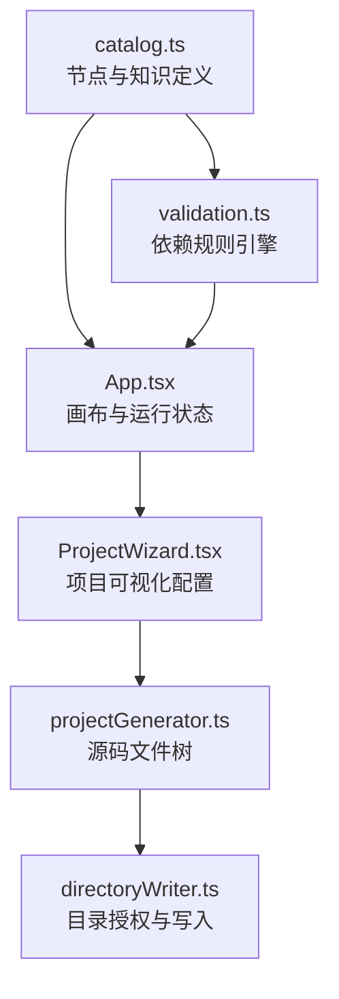

# ServiceSmith Architecture

本文档说明 ServiceSmith 0.1 的核心领域模型、数据流和扩展方式。

## Design goals

1. 拓扑不仅可视化，还应包含可以校验和执行的技术语义。
2. 节点知识、配置和依赖集中声明，避免散落在界面条件分支中。
3. 模拟运行与真实追踪未来能够共享统一事件模型。
4. 项目生成在浏览器本地完成，默认不上传拓扑和凭证。
5. 新增节点和代码模板时尽量不修改画布核心。

## High-level flow

## Domain model

### NodeDefinition

节点定义是节点库的事实来源，包含唯一类型、分类、显示信息、配置、添加条件以及完整的技术知识内容。新增节点应优先扩展 `nodeCatalog`，而不是修改画布组件。

### CanvasNode

画布节点只保存节点 ID、类型、坐标和用户配置。节点知识通过类型从目录查询，避免在每个工作流中重复存储说明内容。

### Edge

连接是独立领域对象，保存源节点、目标节点、协议、调用模式、超时、重试和备注。删除连接不会删除节点。

### ProjectConfig

项目生成配置包含通用命名与端口、Java 或 Go 环境、数据库配置、工程能力开关以及从拓扑选中的服务模块。

## Node validation

`validateNodeAddition` 是无副作用规则函数，支持任一依赖、全部依赖、最少节点数量和最大实例数。点击添加和拖拽添加必须经过同一个校验入口。

## Runtime simulation

0.1 版本使用拓扑广度遍历演示请求路径。后续计划把事件统一为带有 `traceId`、节点 ID、事件类型、输入输出和耗时的运行事件，使模拟引擎与 OpenTelemetry 接入共享展示层。

## Project generation

项目生成分为两个阶段：

1. `generateProjectFiles` 根据框架、项目配置和拓扑生成内存文件映射。
2. `selectDirectoryAndWriteProject` 请求目录权限并递归写入文本文件。

两阶段分离使模板逻辑可以独立测试，也避免生成器直接依赖浏览器文件系统。每个后端服务节点会映射成独立服务模块，基础设施节点会影响依赖、应用配置或容器编排。

## Storage and migration

拓扑保存在 `servicesmith:nodes` 和 `servicesmith:edges`。为兼容早期原型，首次读取时会回退到旧的 `flowlab:*` 键，然后写入新的 ServiceSmith 键。

## Security boundary

- 应用默认不向远端发送拓扑、密码或生成源码。
- 目录写入必须由用户点击触发，并由浏览器展示权限选择器。
- 同名根项目目录存在时，写入操作在创建文件之前终止。
- 生成模板里的凭证只是本地开发默认值，生产部署必须替换。

## Extension points

### Add a node

在 `src/catalog.ts` 增加 `NodeDefinition`，并尽量复用已有通用配置字段。

### Add a framework

扩展 `ProjectStack`，增加向导选项和必要配置，实现输出到 `ProjectFileTree` 的模板函数，并更新文件预览与生成验证。

### Add a runtime engine

运行引擎应消费不可变拓扑快照并输出事件流，不应直接控制 React 组件。
